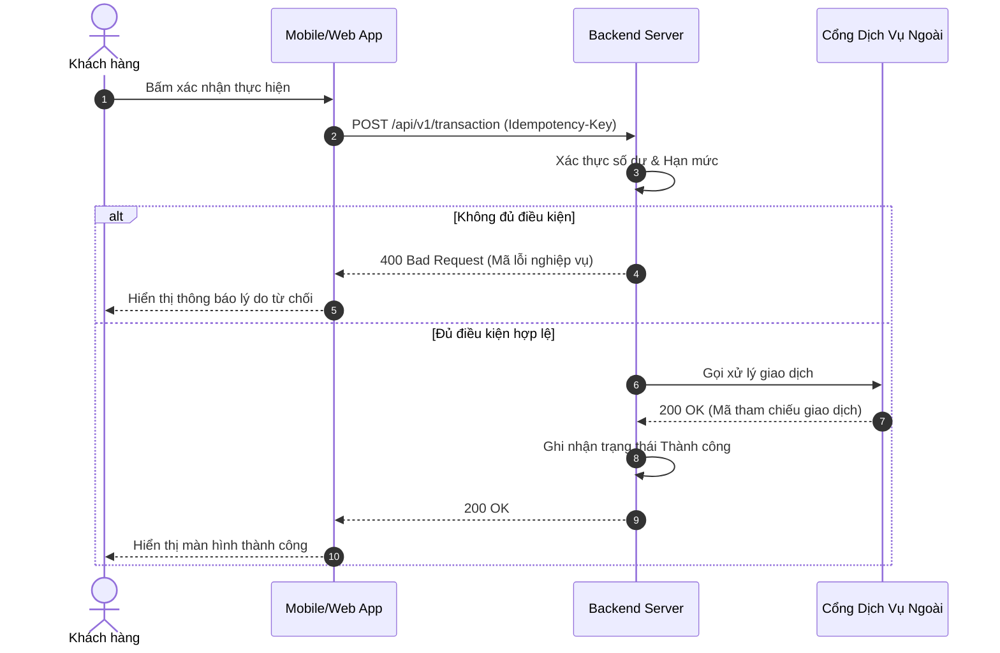
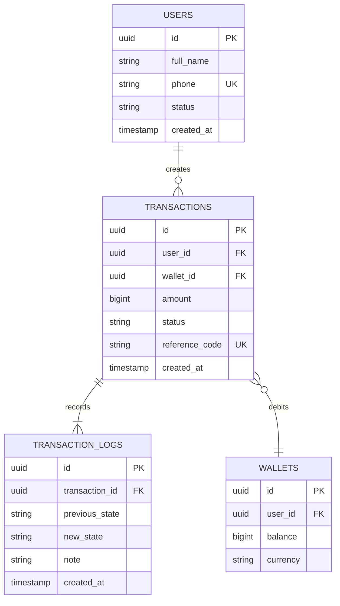
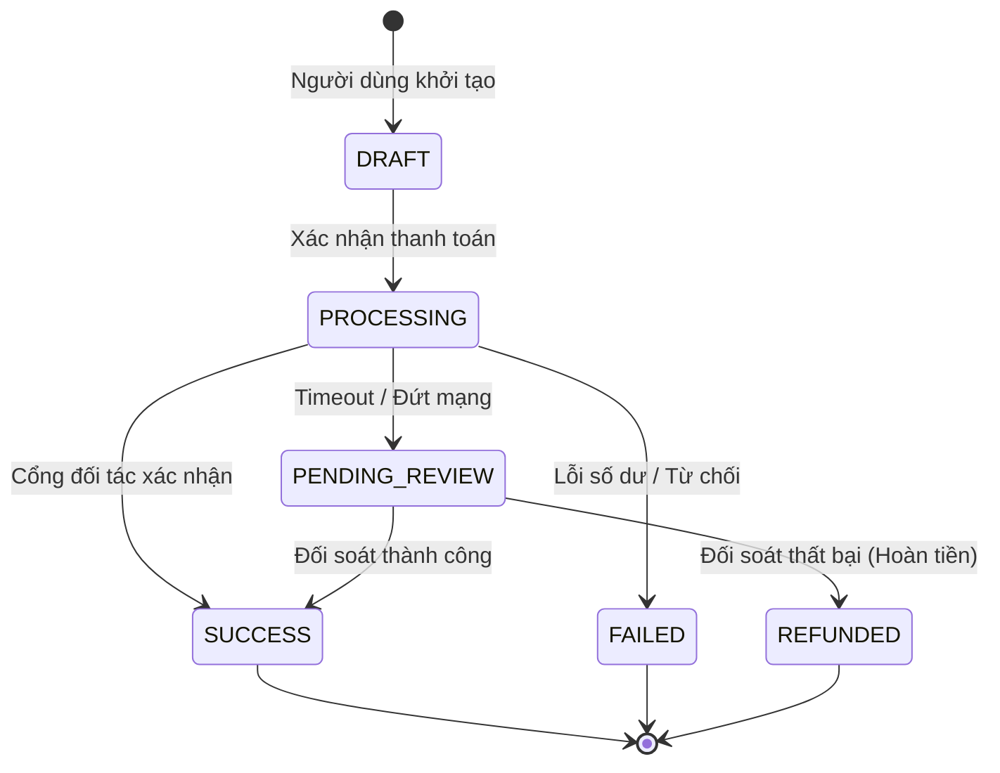

# PRD: {Feature Title}

> **Document Status**: Draft | Review | Approved  
> **Target Release**: {Target Version / Sprint}  
> **Author**: {Author / Team}  
> **Last Updated**: {YYYY-MM-DD}  
> **Feature Slug**: `{feature-slug}`

---

## 1. Executive Summary & Problem Statement

### 1.1. Bối cảnh & Vấn đề (Context & Problem)
- **Bối cảnh thị trường / Sản phẩm**: Mô tả thực trạng hiện tại của người dùng hoặc hệ thống.
- **Nỗi đau chính (Core Pain Points)**:
  - *Pain point 1*: Vấn đề cụ thể người dùng gặp phải.
  - *Pain point 2*: Tắc nghẽn vận hành hoặc rào cản tăng trưởng kinh doanh.

### 1.2. Mục tiêu & Giá trị mang lại (Goals & Value Proposition)
- **Giá trị cho Người dùng (User Value)**: Giải quyết trực tiếp nỗi đau, tiết kiệm thời gian, tăng trải nghiệm mượt mà.
- **Giá trị cho Doanh nghiệp (Business Value)**: Tăng tỷ lệ chuyển đổi, mở rộng doanh thu, tự động hóa quy trình.

---

## 2. Target Personas & Permission Matrix

### 2.1. Chân dung Người dùng Mục tiêu (User Personas)
| Persona | Mô tả vai trò | Nhu cầu chính | Thách thức / Rào cản |
|---|---|---|---|
| **End User / Khách hàng** | Người sử dụng chính | Thao tác nhanh, giao diện rõ ràng | Ngại các bước phức tạp, sợ mất tiền |
| **Merchant / Đối tác** | Quản lý dịch vụ/sản phẩm | Theo dõi đơn hàng, đối soát minh bạch | Chậm trễ cập nhật trạng thái |
| **Admin / Vận hành** | Giám sát & hỗ trợ kỹ thuật | Quản lý tập trung, xử lý ngoại lệ | Thiếu công cụ truy vết lịch sử |

### 2.2. Ma trận Phân quyền Chức năng (RBAC Matrix)
| Chức năng | Khách hàng | Đối tác / Merchant | Quản trị viên (Admin) |
|---|:---:|:---:|:---:|
| Xem thông tin & Khởi tạo yêu cầu | ✅ | ✅ | ✅ |
| Chỉnh sửa / Hủy giao dịch | ✅ (Khi còn pending) | ❌ | ✅ |
| Đối soát & Xuất báo cáo | ❌ | ✅ (Dữ liệu của mình) | ✅ (Toàn hệ thống) |
| Cấu hình tham số & Bật tắt tính năng | ❌ | ❌ | ✅ |

---

## 3. Scope & Phasing (P0 / P1 / P2)

```
┌──────────────────────────┬──────────────────────────┬──────────────────────────┐
│      P0: MVP Core        │     P1: Fast Follow      │   P2: Future & Growth    │
│  (Bắt buộc phải có để    │  (Tối ưu trải nghiệm     │ (Tự động hóa nâng cao,   │
│       ra mắt bản 1.0)    │   & gia tăng tiện ích)   │   trí tuệ nhân tạo)      │
├──────────────────────────┼──────────────────────────┼──────────────────────────┤
│ • Luồng đăng ký & KYC    │ • Đăng nhập sinh trắc học│ • Gợi ý thông minh       │
│ • Luồng thanh toán lõi   │ • Tự động lưu phương thức│ • Tích điểm đa nền tảng  │
│ • Báo cáo trạng thái cơ bản│ • Lịch sử giao dịch chi tiết│ • Tích hợp API đối tác │
└──────────────────────────┴──────────────────────────┴──────────────────────────┘
```

- **Out of Scope (Ngoài phạm vi giai đoạn này)**:
  - Chưa hỗ trợ giao dịch ngoại tệ (chỉ hỗ trợ VND).
  - Chưa tích hợp ví bên thứ ba khác ngoài đối tác chiến lược.

---

## 4. High-Level Architecture & Use Case Diagram

### 4.1. Sơ đồ Use Case Tổng quan (PlantUML)
> *Biểu diễn trực quan ranh giới hệ thống, các Actors và các ca sử dụng cốt lõi bao gồm quan hệ `<<include>>` và `<<extend>>`.*


### 4.2. Ranh giới Hệ thống & Tích hợp (System Boundaries)
- **Hệ thống nội bộ**: Phân hệ xử lý đơn hàng, Phân hệ định danh người dùng (Auth), Database PostgreSQL.
- **Dịch vụ tích hợp ngoài**: Cổng thanh toán (Payment Gateway), Dịch vụ SMS/OTP, Dịch vụ lưu trữ Cloud.

---

## 5. Functional Specifications & User Flows

### 5.1. Luồng Người dùng Chi tiết (Happy Path)
1. **Bước 1**: Người dùng truy cập màn hình tính năng và chọn dịch vụ.
2. **Bước 2**: Hệ thống kiểm tra điều kiện hợp lệ và hiển thị thông tin xác nhận.
3. **Bước 3**: Người dùng xác nhận thao tác (nhập mã PIN/OTP nếu có).
4. **Bước 4**: Hệ thống xử lý giao dịch, cập nhật cơ sở dữ liệu và gửi thông báo thành công.

### 5.2. Sơ đồ Hoạt động Phân làn (Cross-Functional Swimlane)
> *Phân định rõ trách nhiệm giữa Khách hàng, Hệ thống Backend và Đối tác bên ngoài.*


---

## 6. Technical Interactions & Sequence Diagram

### 6.1. Sơ đồ Trình tự Kỹ thuật (Sequence Diagram)
> *Minh họa chi tiết các cuộc gọi API, phản hồi (Response), nhánh xử lý lỗi (Alt/Error flows) và cơ chế Callback.*



### 6.2. Ma trận Xử lý Giao dịch Gián đoạn (Interrupted Transaction Matrix)
| Tình huống đứt gãy | Nguyên nhân | Cơ chế xử lý của Hệ thống | Trải nghiệm Người dùng |
|---|---|---|---|
| **Mất mạng sau khi trừ tiền** | Đứt kết nối trước khi nhận response | Cơ chế Polling tự động kiểm tra trạng thái qua Idempotency-Key | Hiển thị màn hình "Đang đối soát", thông báo sau tối đa 60s |
| **Timeout từ bên thứ 3** | Cổng đối tác phản hồi chậm > 30s | Chuyển trạng thái giao dịch thành `PENDING_REVIEW`, kích hoạt Job Reconciliation | "Giao dịch đang được xử lý, không trừ tiền lặp lại" |
| **Người dùng đóng app ngang** | Thoát ứng dụng lúc đang xử lý | Webhook từ đối tác vẫn cập nhật DB; gửi Notification về máy | Nhận Push Notification khi giao dịch thành công |

---

## 7. Domain Data Model & Entity Lifecycle

### 7.1. Sơ đồ Quan hệ Thực thể Dữ liệu (ERD)
> *Cấu trúc các bảng dữ liệu cốt lõi, khóa chính (PK), khóa ngoại (FK) và kiểu quan hệ.*



### 7.2. Vòng đời & Bảng Chuyển dịch Trạng thái (State Transitions)



---

## 8. Validation Rules & Exact System Wording

### 8.1. Quy tắc Xác thực Dữ liệu (Validation Constraints)
| Trường dữ liệu | Kiểu | Ràng buộc nghiệp vụ | Hành vi khi vi phạm |
|---|---|---|---|
| `amount` | Số nguyên | Tối thiểu 10.000 VNĐ, tối đa 50.000.000 VNĐ/giao dịch | Vô hiệu hóa nút tiếp tục, báo lỗi dưới ô nhập |
| `phone_number` | Chuỗi ký tự | Định dạng 10 chữ số chuẩn đầu số viễn thông Việt Nam | Highlight đỏ ô nhập, báo số điện thoại không hợp lệ |
| `idempotency_key` | UUID | Bắt buộc trong mọi request thay đổi trạng thái tài khoản | Từ chối request 400 nếu trùng lặp trong 24h |

### 8.2. Mẫu Câu Thông báo Hệ thống (Exact UI Copywriting)
| Mã thông báo | Ngữ cảnh xuất hiện | Câu chữ hiển thị chính xác (Exact Wording) | Loại thông báo |
|---|---|---|:---:|
| `ERR_INSUFFICIENT_FUNDS` | Số dư không đủ thanh toán | *"Số dư tài khoản không đủ để thực hiện giao dịch này. Vui lòng nạp thêm tiền."* | Lỗi (Modal đỏ) |
| `ERR_OTP_EXPIRED` | Mã xác thực quá 120 giây | *"Mã xác thực đã hết hạn. Vui lòng nhấn 'Gửi lại mã' để tiếp tục."* | Cảnh báo (Inline) |
| `SUC_PAYMENT_COMPLETED` | Giao dịch hoàn tất | *"Giao dịch thành công! Mã tham chiếu: {ref_code}. Hóa đơn đã được gửi tới email của bạn."* | Thành công (Toast) |

---

## 9. Non-Functional Requirements (NFR)

- **Performance & Latency**: 95% cuộc gọi API phản hồi dưới **500ms** trong điều kiện mạng bình thường.
- **Availability & SLA**: Đảm bảo thời gian khả dụng hệ thống đạt tối thiểu **99.9%** (Uptime).
- **Security & Compliance**: Mã hóa dữ liệu nhạy cảm (AES-256), truyền tải an toàn (HTTPS/TLS 1.3), tuân thủ tiêu chuẩn bảo vệ dữ liệu cá nhân Nghị định 13/2023/NĐ-CP.
- **Audit & Logging**: Lưu vết 100% thay đổi trạng thái tiền tệ vào bảng log riêng biệt, không thể sửa xóa (Append-only).

---

## 10. Success Metrics & Analytics

| Loại chỉ số | Tên chỉ số | Định nghĩa & Cách tính | Mục tiêu sau 30 ngày |
|---|---|---|:---:|
| **North Star** | **Task Completion Rate** | Tỷ lệ người dùng hoàn tất luồng thành công / Tổng số lượt bắt đầu | ≥ 85% |
| **Primary KPI** | **Avg. Transaction Time** | Thời gian trung bình từ bước 1 tới màn hình thành công | ≤ 20 giây |
| **Secondary KPI** | **Drop-off Rate tại Bước OTP** | Tỷ lệ người dùng bỏ dở ở bước xác thực bảo mật | ≤ 5% |
| **Guardrail Metric** | **Error Rate (Lỗi hệ thống)** | Tỷ lệ lỗi 5xx trên tổng số request giao dịch | < 0.1% |
