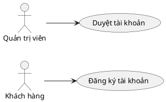

# Usecase Diagram (PlantUML Renderer)

Render file `.puml` (cú pháp PlantUML chuẩn) thành ảnh `.svg`, dùng khi cần
Use Case Diagram hoặc Activity Swimlane Diagram — 2 loại sơ đồ mà Mermaid
không hỗ trợ tốt bằng PlantUML (xem bảng phân loại trong `prd-architect/SKILL.md`
mục "Giai Đoạn 3").

## ⚠️ Cách render — đọc kỹ trước khi dùng

Skill này dùng **server công khai `plantuml.com`**, không cài Java/plantuml.jar
cục bộ (máy không có sẵn Java lúc tạo skill này — 21/09/2026). Nghĩa là:

- **Nội dung file `.puml` được gửi ra internet** mỗi lần render (mã hoá deflate,
  không mã hoá bảo mật — ai chặn được request đều đọc được nội dung sơ đồ).
- **Chỉ dùng cho sơ đồ trừu tượng** (tên actor, tên use-case, luồng nghiệp vụ
  khái quát) — **tuyệt đối không** đưa số liệu thật, tên khách hàng thật, hay
  bất kỳ dữ liệu Vùng Đỏ nào vào nội dung `.puml` trước khi render.
- Nếu cần render nội bộ hoàn toàn (không gửi ra ngoài), phải cài Java + tải
  `plantuml.jar` về máy rồi sửa `render.py` — chưa làm vì chưa được yêu cầu.

## Cách dùng

```powershell
python "<base-dir-của-skill>/render.py" "duong/dan/toi/file.puml"
python "<base-dir-của-skill>/render.py" "duong/dan/toi/file.puml" --out "duong/dan/ra/anh.svg"
```

Trong đó `<base-dir-của-skill>` là "Base directory for this skill" mà Claude
Code báo lúc kích hoạt — **không hardcode** đường dẫn máy cụ thể (bài học từ
`prd-architect`, xem `../prd-architect/SKILL.md` Giai Đoạn 5).

Mặc định file `.svg` xuất ra cùng thư mục, cùng tên với file `.puml` đầu vào
(chỉ đổi đuôi). Dùng `--out` để chỉ định đường dẫn khác.

## Quy trình

1. Nhận cú pháp PlantUML từ người gọi (ví dụ do `prd-architect` sinh ra ở
   Giai Đoạn 5, hoặc người dùng tự viết trực tiếp).
2. Ghi nội dung đó ra một file `.puml` tạm hoặc file đích trong dự án
   (ví dụ `docs/{feature}/prd/assets/{name}.puml`).
3. Chạy `render.py` với đường dẫn file đó.
4. Kiểm tra file `.svg` sinh ra tồn tại và không rỗng trước khi báo hoàn tất.
5. Nếu `render.py` báo `[LỖI]` (thường do mất mạng hoặc server plantuml.com
   không phản hồi) — báo lại nguyên văn lỗi cho người dùng, không tự bịa
   rằng đã render thành công.

## Ví dụ cú pháp PlantUML tối thiểu (Use Case Diagram)


